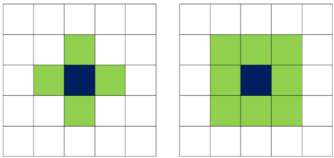

# Dyskretna symulacja rozrostu ziaren metodą automatów komórkowych i Monte Carlo

#### Metoda ta pozwala na wygenerowanie mikrostruktur. Jest skalowalna i podatna na różnego rodzaju optymalizacje. W tym wydaniu jest to serwerowa wersją sekwencyjna aplikacji.

Alokacja siatki odbywa się w klasie Space i wykonywana jest przy użyciu konstruktora. Istotnym faktem jest pewnego rodzaju nadmiarowość na tym etapie – alokowana jest
siatka powiększona o 1 z każdej strony. Pomaga to programiście przy pracy z warunkami brzegowymi.

Symulacja pozwala na dobór parametrów przestrzeni (wysokość, szerokość, głębokość, warunek brzegowy), ilości zarodków, sąsiedztwa oraz ilości cykli dla metody Monte Carlo.

Metoda implementująca zarodkowanie została napisana w taki sposób, aby nie dopuścić do nadpisania wcześniej wylosowanego zarodka innym.

Umożliwiono wybór dwóch rodzajów sąsiedztw - Von Neumanna oraz Moore'a

Rys 1. Sąsiedztwa: Von Neumanna (po lewej), Moore'a (po prawej) 

W przypadku warunku absorbującego nadmiarowo zaalokowana przestrzeń wypełniona jest zerami i
powodować będzie „ucinanie” symulacji na brzegach. W przypadku warunku periodycznego
zastosowana zostanie stosowna funkcja modyfikująca jedynie nadmiarowo zaalokowane brzegi.

Rys. 2 - Przykładowa mikrostruktura wygenerowana metodą automatów komórkowych
