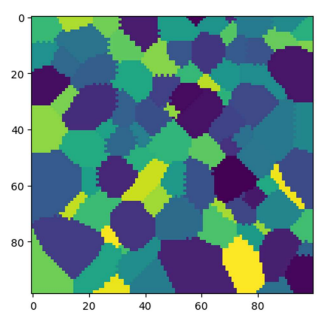

# Dyskretna symulacja rozrostu ziaren metodą automatów komórkowych i Monte Carlo

######Metoda ta pozwala na wygenerowanie mikrostruktur. Jest skalowalna i podatna na różnego rodzaju optymalizacje.

Alokacja siatki odbywa się w klasie Space i wykonywana jest przy użyciu konstruktora. Istotnym faktem jest pewnego rodzaju nadmiarowość na tym etapie – alokowana jest
siatka powiększona o 1 z każdej strony. Pomaga to programiście przy pracy z warunkami brzegowymi.

W przypadku warunku absorbującego nadmiarowo zaalokowana przestrzeń wypełniona jest zerami i
powodować będzie „ucinanie” symulacji na brzegach. W przypadku warunku periodycznego
zastosowana zostanie stosowna funkcja modyfikująca jedynie nadmiarowo zaalokowane brzegi.

Rys. 1 - Przykładowa mikrostruktura wygenerowana metodą automatów komórkowych